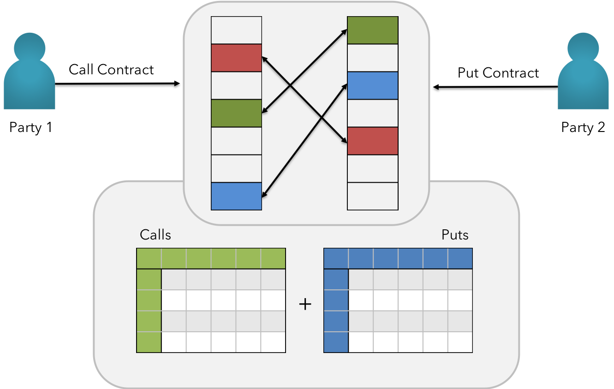

### DEX - Decentralized Exchange

 <b>Fig 17:</b> KIP Inline DEX Matching Engine  

$$
\Delta
$$

KIP not only features the DEX, but also exposes the underlying routes of matching engine to encourage diverse set of developers to access systemic token supply & demand information and solve the needs inherently close to real-time. This is made possible by leveraging dynamic libraries in building flavored exchanges within applications or elsewhere.