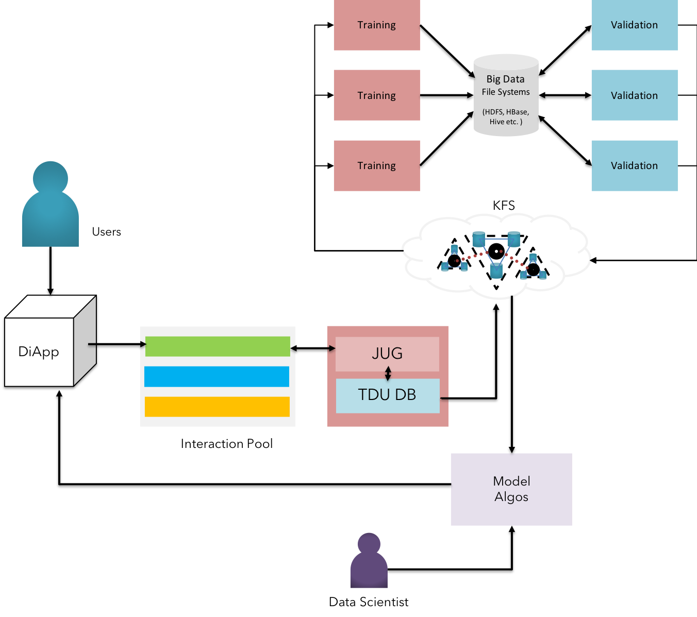

### Analytics & AI Practices

 <b>Fig 22:</b> Analytics & AI Practices on KFS  

$$
\Delta
$$

Large amounts of transactional raw data as well as structured information can be stored in KFS for performing analytical processing. Krama Cognitive Services offer multi-level heterogenous integration with Machine Learning Algorithms, Neural Networks, Expert Systems & other AI-based models etc.