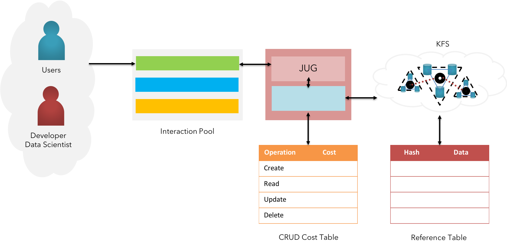
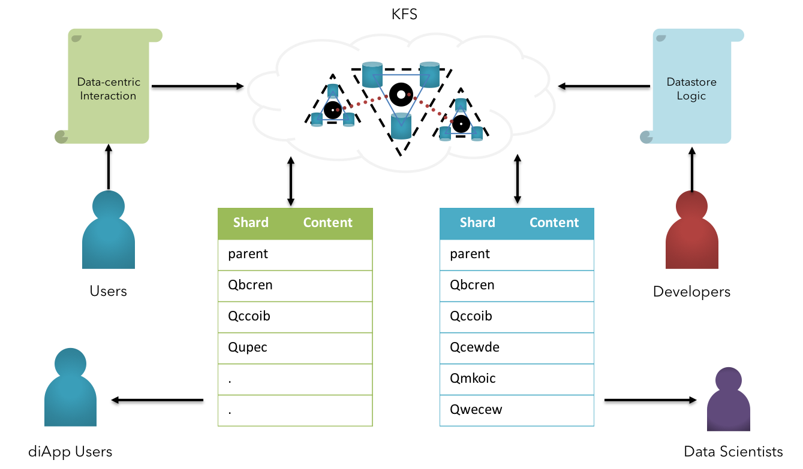

### Big Data & Sharding

 <b>Fig 19:</b> KFS - Big Data Persistence  

$$
\Delta
$$

KFS is designed in an effective manner to support the persistence & operation of large volumes of Big Data.

 <b>Fig 20:</b> KFS - Sharding Approach  

This is made possible by integrating our file system with HDFS<a href="#references">[20]</a> at a fundamental, a highly scalable filesystem for copious amount of Big Data. The native interface is established to create, read, update & delete the information between shared between internal big data file systems and respective KFS network.  