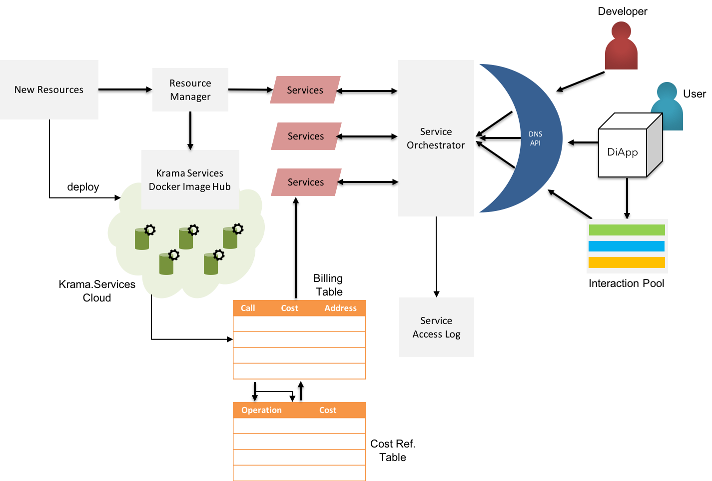

### Krama Service Interface

Applications in the enterprise environment demands high availability of services along a degree of service & location transparency. Some of the existing blockchain platforms have failed at both: achieving the service integrations with existing infrastructure & solution realms without compromise in availability and cost.  

 <b>Fig 12:</b> KSI - Krama Service Interface (Internal Architecture)  

$$
\Delta
$$

Although oracles<a href="#references">[17]</a> are available in a few blockchain platforms such as Ethereum, the success rate of absorbing external information into Blockchain is very less. The liabilities of using existing Oracles are not only limited to predicted availability but also loops the gas cost payable for such services.

Krama Service Interface (KSI) is a breakthrough enhancement to current thinking on Oracles for services. Krama Services has four major purposes:

1. Manage & generalize resources
2. Maintain availability & service-level transparency
3. Account the service usage
4. Measure the utility of services as billable