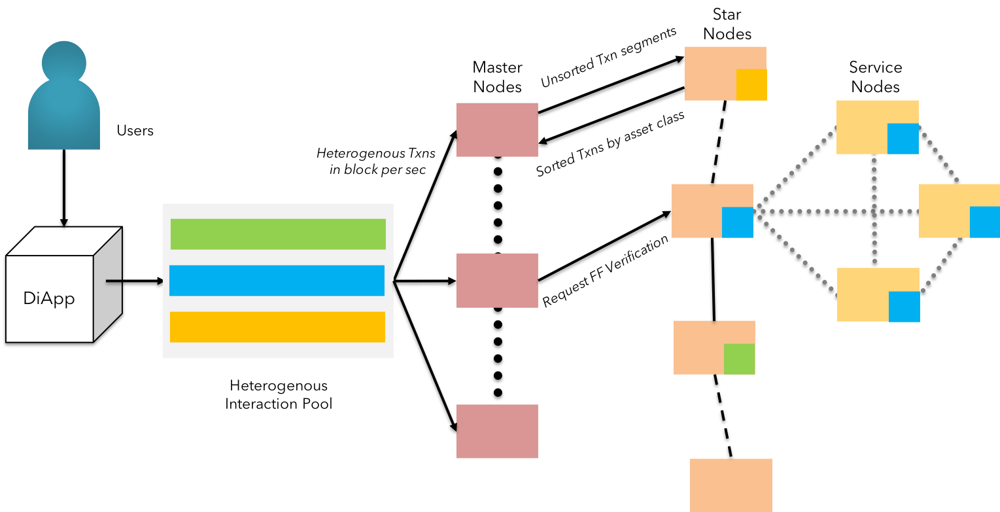

### Throughput

KIP facilitates high frequency enterprise operations by leveraging the reactive actor streams<a href="#references">[13]</a> offered by TARA. Reactive streams are based on the concept of deadlock-free "execute-only-once" ordering<a href="#references">[14]</a>.

The state channels hosted by the grand nodes & star nodes are facilitated by an actor concurrency model consisting of hybrid `mutex` & `chan` spaces across the network. This hybrid structure allows us to achieve concurrency without tradeoffs at the JUG(EVM<a href="#references">[15]</a>-like) on blocking calls needed to perform function calls. However, each node belonging to respective state channel is a member of a subset of a super-set channel, thereby maintaining systemic information on the wallets & smart contracts.  

 <b>Fig 3:</b> KIP - Actor-based throughput model with reactive streams 

$$
\Delta
$$

Each actor across the KIP's Grand-Star network uses message passing to classify & funnel the stream of transactions to respective state channels, in a purely asynchronous manner.
Each transaction transmitted by diApps (technically clients) to any one of the grand nodes in the KIP network is considered as a message. The incoming message is timestamped (client-level) & payload is assigned a metadata tag based on the function responsible for the RPC / API call.

> **Throughput - Formal Notation:**  
>
> **STEP 1:** The p2p connection established between the Grand Nodes and the Star Nodes form the *"Orderer Network"*
>
> **STEP 2:** One or more grand nodes receive transaction requests from the clients (diApps). The incoming transactions (in the range of millions) are partitioned between the grand nodes.
>
> **STEP 3:** The partitioned transactions received by the controller (grand node) are segmented and assigned to the participating actors(star nodes) for classification, based on the nature of transaction captured by the function call's metadata
>
> **STEP 4:** The star nodes are assigned unique transactions to ensure "execute-only-once" by design. Star nodes perform the classification based on the metadata received and the validity of payload
>
> **STEP 5:** The ordered classification is returned back to the controller (the calling grand node)
>
> **STEP 6:** The grand nodes upon receiving the result, propagates the ordered transactions to respective state channels for fast forward verification
>
> **STEP 7:** If any actor is unable to perform the assigned task of classification, the task is forwarded to a fellow actor available at the earliest.
>
$$
\Delta
$$