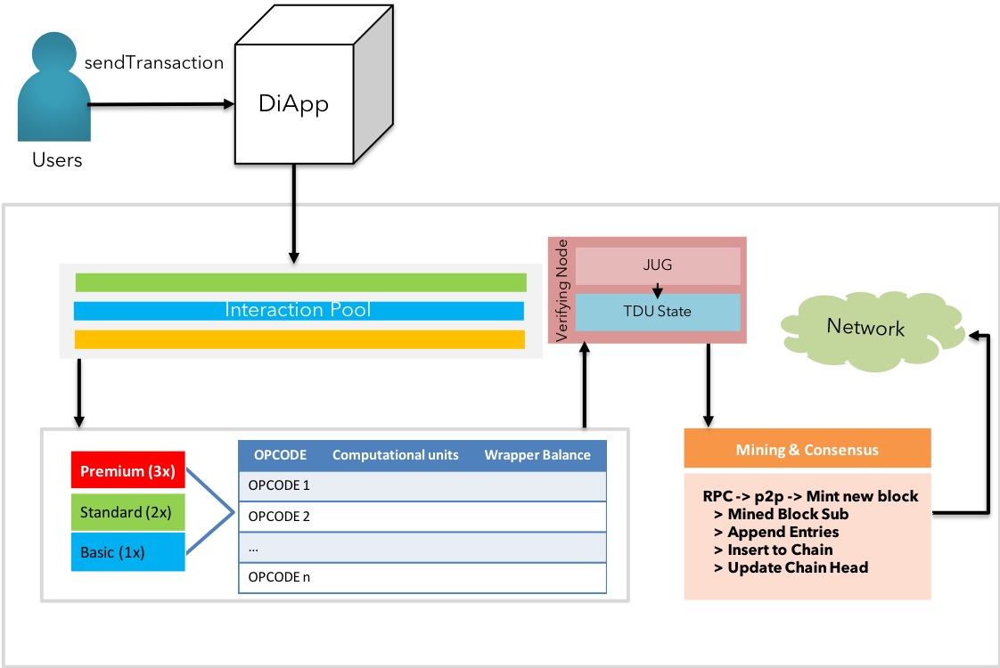

### Transaction lifecycle

 <b>Fig 10:</b> KIP's transaction lifecycle  

The revised flow with auxiliary features offered by KIP are as follows:  

> **KIP Transaction Lifecycle - Formal Notation:**  
>
> **STEP 1:** User initiates a transaction by signing with the private key
>
> **STEP 2:** Transaction is bundled with nonce, platform fee, tagged asset class & tier by diApp
>
> **STEP 3:** The bundle is transported by the diApp into KIP network's transaction pool
>
> **STEP 4:** The grand nodes managing the transaction pool assigns the sorted transactions to respective state channels based on the asset class, and tiers.
>
> **STEP 5:** The ordered transactions are assigned to the star nodes, followed by the service nodes in the respective state channel (fast followers)
>
> **STEP 6:** The service nodes verify the transaction versus the account's attributes
>
> **STEP 7:** The star nodes confirm the fast follow & broadcast the transactions to other state channels and shadow pool  
>
> **STEP 8:** The followers in the other state channels & the shadow pools formally confirm the transactions
>
> **STEP 9:** Consensus is achieved and the block is published
>
> **STEP 10:** Corresponding accounts are updated with the new state

$$
\Delta
$$